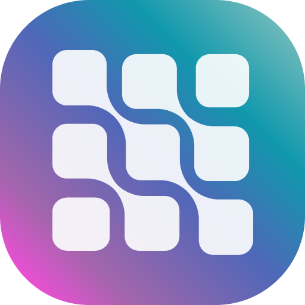
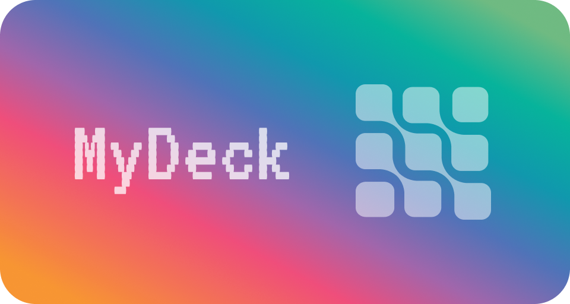

  
  <h1>MyDeck</h1>
  <strong>remote macro board with companion app</strong>
   
   
  

## Virtual Macro Board  - What is MyDeck? 📱

Easily control your computer with this fully customizable Deck Buttons Board (like a macro keyboard but configurable). Support custom Actions extendable with Plugins. Available on Windows, MacOS, Linux (desktop) and Android, iOS (companion app).

#### Developer notes

> **b3nab**: I'm developing this app on a live stream! You can follow my adventures on Twitch at: https://twitch.tv/b3nab

---

# Features

- Configurable dimensions (numbers of rows and columns)
- Up to 150 buttons per page
- Customize Buttons
  - Colors
  - Image (supports: png, jpg and jpeg, webp and even GIFs!)
  - Shape (circle, squared or transparent)
  - and more..
- Easily save and load .board files
- Switch buttons' position with drag and drop
- Extendable with plugins, write your custom action!

---

# Download

### **MyDeck Configurator** - Desktop App

(download soon)

### **MyDeck Companion** - Mobile App

(download soon)

---

### Project Structure

MyDeck has the main desktop app that act as a server on LAN and then there is a mobile app (like a companion app) that let you interact with your configured board.
Repo structure:

- mydeck
  - packages
    - desktop
    - mobile
    - ui
    - plugins
  

### CONTRIBUTE

If you are a developer and you know javascript and nodejs you can came on "board"! Feel free to submit any Pull Request/Issue/or any other kind of contribution you want to submit. Really apprecciate!
