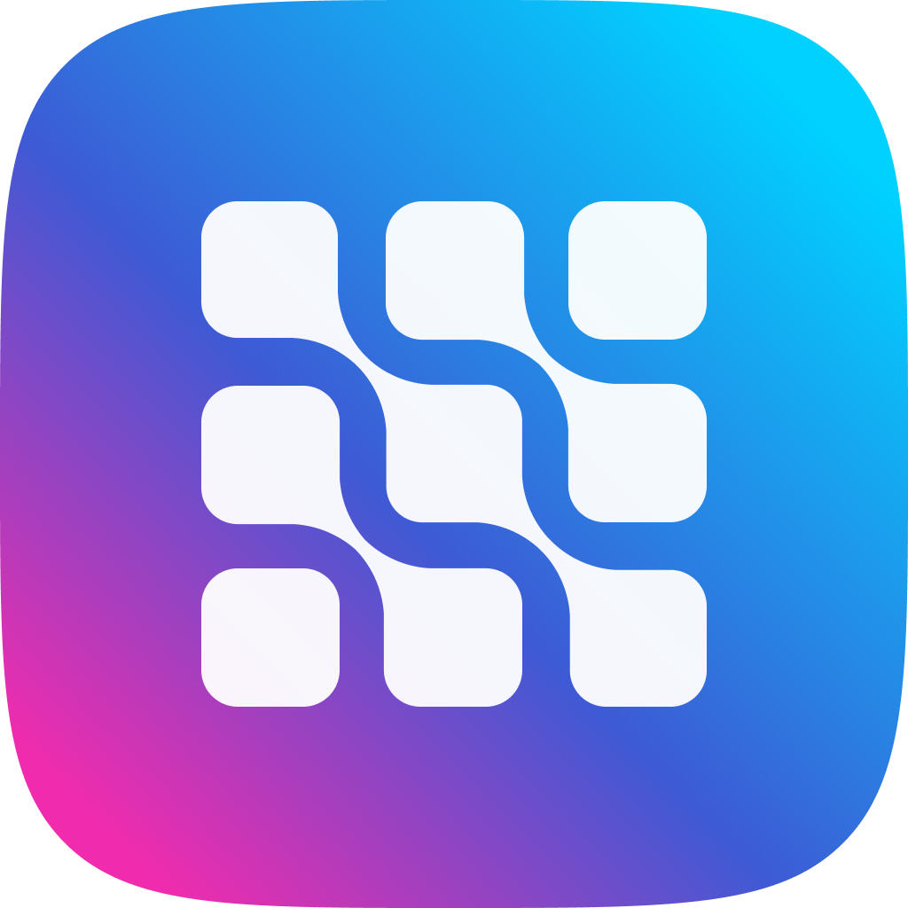
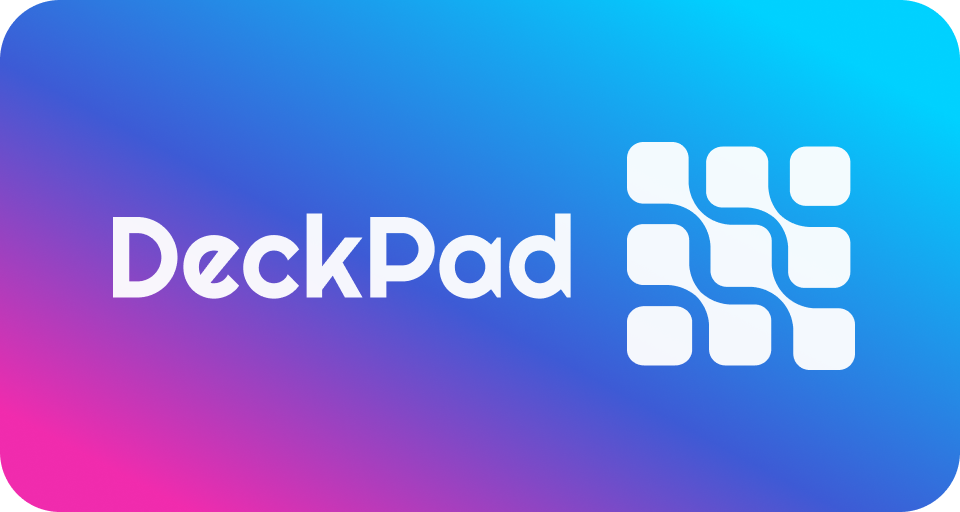

  
  <h1>DeckPad</h1>
  <strong>remote macro board with companion app</strong>
   
   
  

## Virtual Macro Board  - What is DeckPad? 📱👉🖥️

Easily control your computer with this fully customizable Deck Buttons Board (like a macro keyboard but configurable). Support custom Actions extendable with Plugins. Available on Windows, MacOS, Linux (desktop) and Android, iOS (companion app).
<!-- 
#### Developer notes

> **b3nab**: I'm developing this app on a live stream! You can follow my adventures on Twitch at: https://twitch.tv/b3nab -->

## Features

- Configurable dimensions (numbers of rows and columns)
- Up to 150 buttons per page
- Customize Buttons
  - Colors
  - Image (supports: png, jpg and jpeg, webp and even GIFs!)
  - Shape (circle, squared or transparent)
  - and more..
- Easily save and load .board files
- Switch buttons' position with drag and drop
- Extendable with plugins, write your custom action! (WIP feature)
# Download

The app is actually in alpha stage and there is available a link to download configurator and companion apps. Enjoy! 🥂

### 💻 Desktop App - Configurator

#### **Alpha Release**
| Platform | Download |
| -- | -- |
| Windows | [DeckPad_win.exe](https://github.com/b3nab/deckpad/releases/latest/download/DeckPad_win.exe) |
| MacOS | [DeckPad_mac.dmg](https://github.com/b3nab/deckpad/releases/latest/download/DeckPad_mac.dmg) |
| Linux | [DeckPad_linux.AppImage](https://github.com/b3nab/deckpad/releases/latest/download/DeckPad_linux.AppImage) |

### 📱 Mobile App - Companion

(download soon)

---

### Project Structure

DeckPad has the main desktop app that act as a server on LAN (it needs WiFi/Ethernet connectivity) and then through his mobile app (like a companion app) let you interact with your configured board.
Repo structure:

- deckpad
  - packages
    - desktop
    - mobile
    - sdk
  

### CONTRIBUTE

If you are a developer and you know javascript and nodejs you can came on "board"! Feel free to submit any Pull Request/Issue/or any other kind of contribution you want to submit. Really apprecciate!
